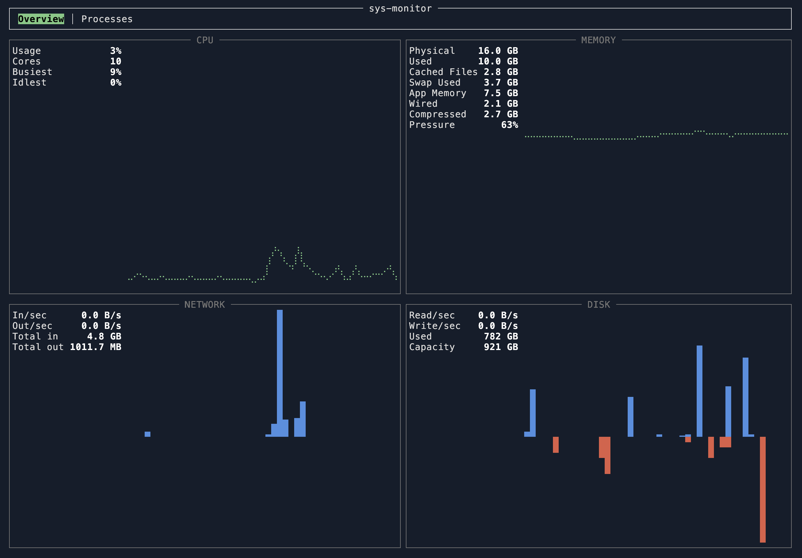
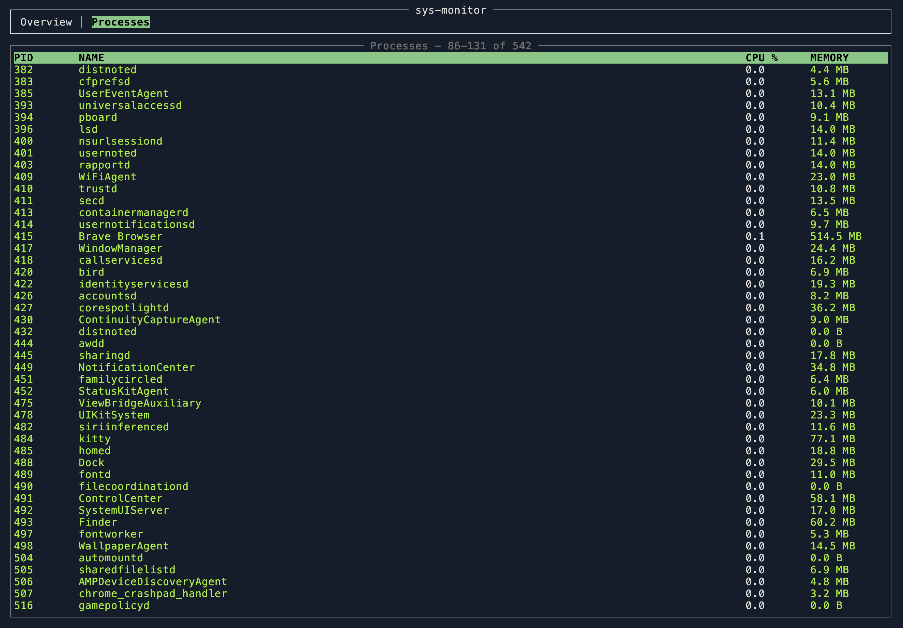
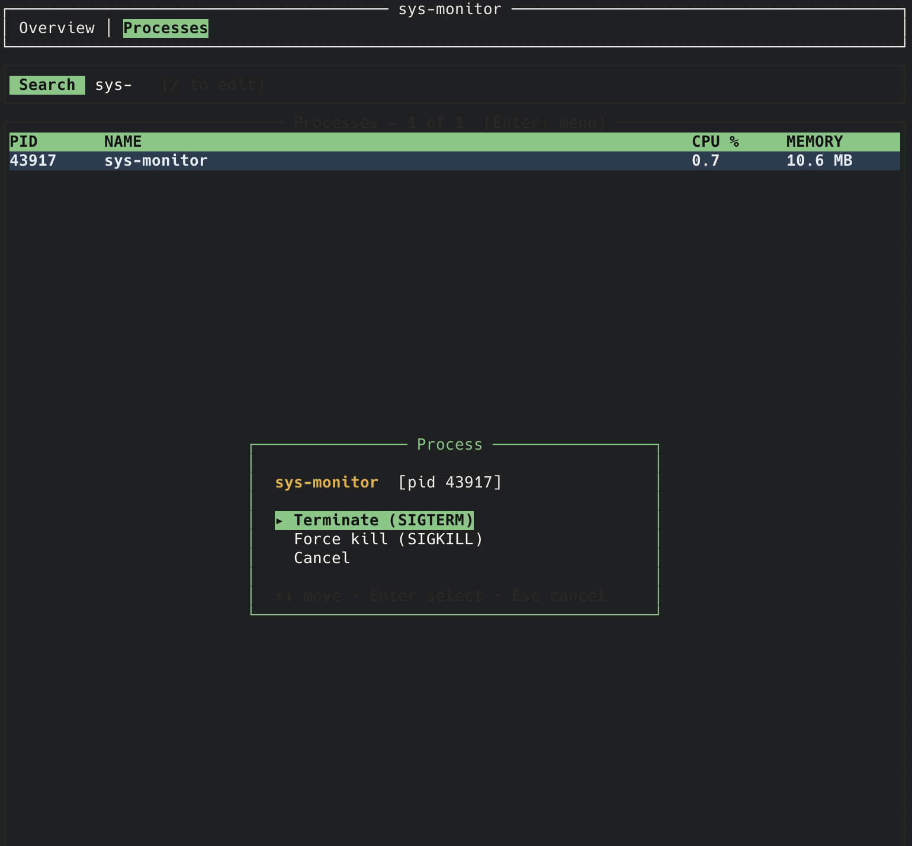

# sys-monitor

A terminal system-activity monitor in the spirit of macOS Activity Monitor,
built with [ratatui](https://ratatui.rs). Live graphs for CPU, memory, network,
and disk on one screen, plus a searchable, scrollable process list.

### Overview



### Processes



### Process actions

Press `Enter` on a process to open an action menu — search, then terminate or
force-kill the selected process.



## Features

- **Overview tab** — CPU, Memory, Network, and Disk shown together in a 2×2 grid.
  - CPU and Memory render as smooth braille **line** graphs on a fixed 0–100 scale.
  - Network and Disk render as **filled, mirrored** area graphs (in/read up,
    out/write down), auto-scaled to their peak.
  - Each cell carries a stats column with live numbers.
- **Processes tab** — full, scrollable process table sorted by PID for a stable
  view (rows update in place instead of jumping around), with CPU-colored rows.
  - **Search** by name or PID.
- **Memory pressure colouring** — green / yellow / red as usage climbs.
- **Pause** the live sampling at any time.
- Graphs scroll right-to-left: the newest sample is always at the far right.

## Metrics and where they come from

| Metric | Source |
|--------|--------|
| CPU usage (global + per-core busiest/idlest) | `sysinfo` |
| Memory: Physical, Used, Swap Used | `sysinfo` |
| Memory: Cached Files, App Memory, Wired, Compressed | `vm_stat` (macOS only) |
| Network rx/tx per second + totals | `sysinfo` |
| Disk read/write per second + space used/capacity | `sysinfo` |
| Process list (PID, name, CPU %, memory) | `sysinfo` |

The macOS-only memory breakdown is parsed from `vm_stat`:

- **Wired** = pages wired down
- **Compressed** = pages occupied by compressor
- **App Memory** = anonymous − purgeable pages
- **Cached Files** = file-backed + purgeable pages

On non-macOS platforms those four fields show `—`; everything else still works.

## Install & run

Requires a recent Rust toolchain (built with 1.91, edition 2024) and a terminal
with truecolor support (iTerm2, Ghostty, kitty, modern Terminal.app).

```sh
cargo run --release
```

## Keybindings

| Key | Action |
|-----|--------|
| `Tab` / `→` / `l` | next tab |
| `Shift-Tab` / `←` / `h` | previous tab |
| `1` – `2` | jump to tab (Overview / Processes) |
| `↑` `↓` / `j` `k` | scroll the process list |
| `PgUp` / `PgDn` | scroll by a page |
| `Home` / `g` | jump to the top of the list |
| `/` | search processes by name or PID (Enter keeps, Esc clears) |
| `space` | pause / resume sampling |
| `?` | toggle the help overlay |
| `q` / `Esc` / `Ctrl-C` | quit |

Sampling runs once per second; each graph keeps the last ~minute of history.

## Architecture

Single-threaded event loop — no background threads. Each tick samples the OS,
pushes one value into each metric's ring buffer, and redraws.

| File | Responsibility |
|------|----------------|
| `src/main.rs` | terminal setup/teardown, panic-safe restore, event loop, keys |
| `src/app.rs` | `App` state: active tab, metrics, processes, search, flags |
| `src/metric.rs` | `Metric` — capped history ring buffer + stats list |
| `src/collect.rs` | `Collector` over `sysinfo` (+ `vm_stat`); samples every metric |
| `src/graph.rs` | filled-area graph widget (single + mirrored dual series) |
| `src/ui.rs` | tab bar, the Overview grid, the Processes table, help overlay |

## Development

```sh
cargo test      # unit + render (TestBackend) tests
cargo clippy    # lint
```

## Roadmap

More features are on the way:

- **Per-core CPU** sparklines (one mini graph per core)
- **Kill / signal** a selected process from the Processes tab
- **Sortable** process table (by CPU, memory, name)
- **GPU usage** and **temperature / fan** sensors
- **Per-interface network** and **per-volume disk** breakdowns
- **Configurable** refresh rate and color themes
- **Alert thresholds** (highlight when CPU/memory cross a limit)
- **CSV export / logging** of history

Suggestions and PRs welcome.

## License

[MIT](LICENSE) © 2026 Nazrul Islam
